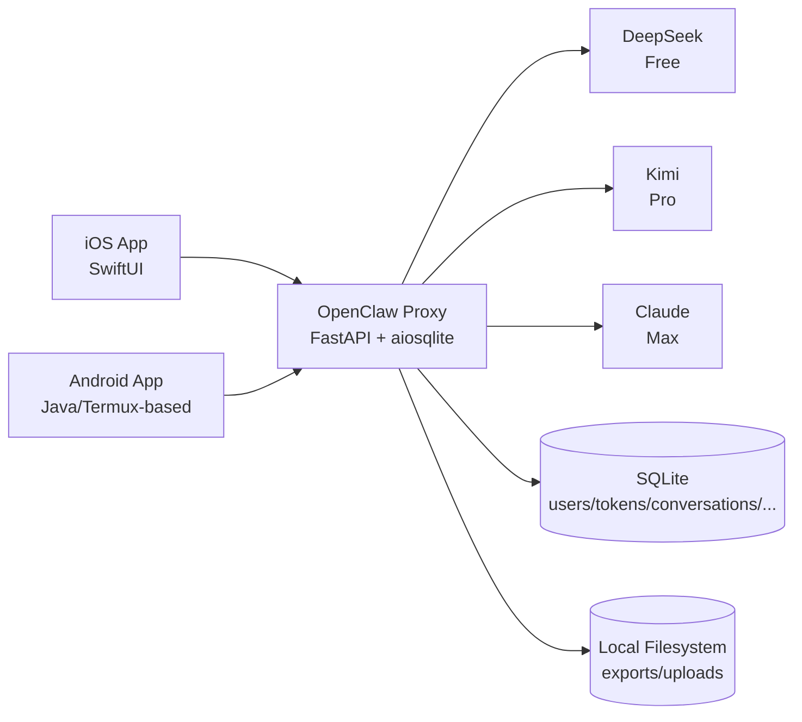
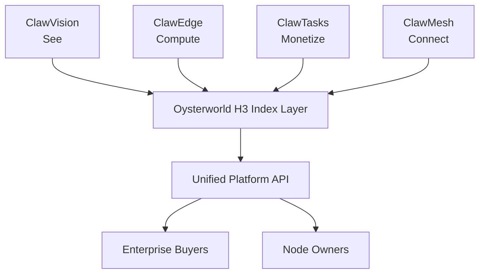
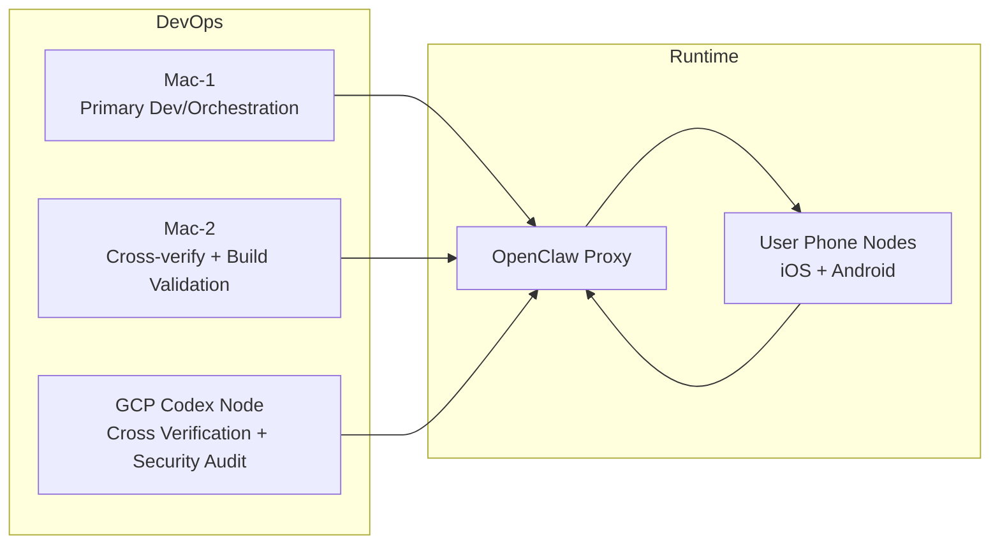
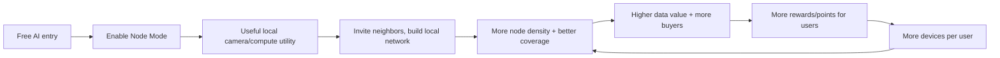

# ClawPhones Unified Architecture

> **Audience**: New engineers + Investor technical DD  
> **Last Updated**: 2026-02-11  
> **Sources**: `README.md`, `proxy/server.py`, `ios/ClawPhones/*`, `android/clawphones-android/*`, `specs/SPRINT-2-10-FINAL-VERIFICATION.md`, `~/Downloads/specs/clawphones-next-gen-architecture.md`

## 1. Executive Summary
ClawPhones 当前是一个「双端移动客户端 + FastAPI 网关 + 多模型路由 + SQLite 持久化」系统：iOS/Android 统一走 OpenClaw Proxy，按 token tier 自动路由 DeepSeek/Kimi/Claude。  
在产品方向上，下一阶段从“移动 AI 助手”升级为“闲置手机共享网络”，核心是四根支柱：**ClawVision + ClawEdge + ClawTasks + ClawMesh**，并通过 Sprint 11-20 逐步落地。

## 2. Current System Architecture (As-Is)
### 2.1 Runtime Topology

### 2.2 Repository Structure (Developer View)
| Module | Path | Role |
|---|---|---|
| Backend Gateway | `proxy/server.py` | API 网关、认证、限流、LLM 路由、会话存储、上传、导出、分析、崩溃报告 |
| iOS Client | `ios/ClawPhones/` | SwiftUI UI + ViewModel + OpenClawAPI + Keychain + STT + Analytics + Crash |
| iOS Share Extension | `ios/ClawPhonesShare/` | 文件分享入口，App Group + Deep Link 桥接 |
| Android Client | `android/clawphones-android/app/src/main/java/ai/clawphones/agent/` | Java 客户端、登录/会话/聊天/设置/预装/网关控制 |
| Android Chat API | `android/.../chat/ClawPhonesAPI.java` | 认证、会话、流式聊天、上传、导出、profile/plan/ai-config |
| Shared Android Runtime | `android/clawphones-android/termux-*` | Termux runtime + terminal emulator/view |

### 2.3 Key Runtime Contracts
| Contract | Current State |
|---|---|
| Auth | `Bearer ocw1_*` device token；支持注册/登录/Apple 登录与 refresh |
| Tier Routing | free/pro/max -> DeepSeek/Kimi/Claude |
| Data Persistence | SQLite 本地 DB + 本地文件目录（`exports`/`uploads`） |
| Streaming | `/v1/conversations/{id}/chat/stream` SSE |
| File Upload | `/v1/upload?conversation_id=...`（同时兼容会话路径上传） |

## 3. Sprint 2-10 Delivery Baseline
### 3.1 Verification Matrix (from final byzantine verification)
| Sprint | Focus | PASS | FAIL | PARTIAL | BLOCKED |
|---|---|---:|---:|---:|---:|
| 2-3 | i18n / Markdown / SSE / Token Refresh / Settings | 5 | 0 | 0 | 0 |
| 4-5 | Push / Error Handling / TTS / STT / Voice UI / Onboarding | 3 | 3 | 0 | 0 |
| 6 | Offline Queue / Cache / Dark Mode / Share Ext / Apple Sign-in | 4 | 0 | 1 | 0 |
| 7 | Markdown+ / Upload / File Share | 2 | 1 | 0 | 0 |
| 8 | Biometric / Account Delete / Data Export | 2 | 0 | 1 | 0 |
| 9 | Launch + Memory Optimization | 2 | 0 | 0 | 0 |
| 10 | Analytics / App Store Prep / Release Build | 2 | 0 | 1 | 1 |
| **Total** |  | **20** | **4** | **3** | **1** |

### 3.2 Original Gaps Before Today’s Fixes
- P0 安全: 明文敏感信息、硬编码凭据、HTTP 明文链路、admin auth 实现不一致。  
- Sprint 7: 图片上传端点不满足 `/v1/upload` 要求。  
- P1: 限流覆盖、依赖声明、跨端枚举一致性等。

## 4. Today’s Completed Fixes (P0 + S7 Upload + P1)
> 下表基于当前代码快照（2026-02-11）抽取。

| Fix Group | Implemented | Evidence |
|---|---|---|
| P0 Security | Admin key 常量时间比较，统一 crash admin 校验路径 | `proxy/server.py:3761`, `proxy/server.py:3926`, `proxy/server.py:3951` |
| P0 Security | HTTPS-only client/network config（禁用 cleartext） | `ios/ClawPhones/Services/DeviceConfig.swift:53`, `android/.../AndroidManifest.xml:56`, `android/.../network_security_config.xml:7` |
| P0 Security | 脚本凭据改环境变量读取 | `proxy/scripts/auto_fix_dispatcher.py:35`, `proxy/scripts/crash_analyzer.py:33` |
| P0 Security | Android 签名密码改环境变量 | `android/clawphones-android/app/build.gradle:104`, `android/clawphones-android/app/build.gradle:106` |
| S7 Upload | 新增标准上传入口 `/v1/upload` | `proxy/server.py:3123` |
| S7 Upload | iOS/Android 客户端接入 `/v1/upload?conversation_id=...` | `ios/ClawPhones/Services/OpenClawAPI.swift:414`, `android/.../ClawPhonesAPI.java:649` |
| S7 Upload | `file_ids` 贯穿 chat + stream + 存储元数据 | `proxy/server.py:469`, `proxy/server.py:3202`, `proxy/server.py:3327` |
| P1 Feature | 全局限流中间件 + 路由桶策略 | `proxy/server.py:50`, `proxy/server.py:1818` |
| P1 Feature | 依赖补齐（Firebase Messaging / PyPDF2） | `android/.../app/build.gradle:37`, `proxy/requirements.txt:8` |
| P1 Feature | 跨端 tier/persona 规范化对齐 | `ios/ClawPhones/ViewModels/SettingsViewModel.swift:15`, `ios/ClawPhones/ViewModels/SettingsViewModel.swift:63`, `android/.../ClawPhonesAPI.java:1263`, `android/.../ClawPhonesAPI.java:1409` |

### 4.1 Remaining Risks To Track (DD transparency)
| Area | Current Observation | Evidence |
|---|---|---|
| Sensitive Info Display | Dashboard 仍读取 `~/.ssh_password` 并展示 | `android/.../DashboardActivity.java:392`, `android/.../DashboardActivity.java:402` |
| Push/TTS End-to-End | 当前代码中未检索到 iOS APNs 注册、Android Manifest 的 FCM service 声明、或 TTS 引擎接入证据 | `ios/ClawPhones/*`, `android/.../AndroidManifest.xml` |

## 5. Four Pillars (To-Be Product Architecture)
### 5.1 ClawVision
面向“分布式眼睛”：低功耗采集、事件触发上传、H3 cell 索引、邻里守望网络、时空回放。

### 5.2 ClawEdge
面向“分布式大脑”：把闲置手机 CPU/GPU 纳入可调度算力池，跑轻量推理与数据预处理任务。

### 5.3 ClawTasks
面向“数据市场”：将节点数据/分析结果商品化，支持被动收入（节点自动）与主动任务（定向拍摄）。

### 5.4 ClawMesh
面向“分布式神经网络”：设备互联、任务路由、边缘缓存、带宽共享。

### 5.5 Pillar Interaction

## 6. Sprint 11-20 Roadmap
| Sprint | Name | Core Deliverables | Dependencies |
|---|---|---|---|
| 11 | ClawVision Foundation | Node Mode UI + camera capture + motion detection + push | Oysterworld relay |
| 12 | ClawVision AI | On-device detection (person/car/package) + smart alert | Sprint 11 |
| 13 | Neighborhood Watch | network create/join + shared alert + coverage map | Sprint 12 |
| 14 | ClawTasks Passive | automatic data monetization + points | Sprint 12 |
| 15 | ClawTasks Active | task marketplace + buyer API + quality validation | Sprint 14 |
| 16 | Edge Compute | node capability registry + scheduler + compute monetization | Sprint 11 |
| 17 | On-Device AI | local small model + offline mode + privacy mode | none |
| 18 | Voice + Vision | TTS + voice dialog + camera Q&A | Sprint 12 |
| 19 | Developer Platform | open API + SDK + webhook | Sprint 15,16 |
| 20 | Scale-Out | PostgreSQL migration + Redis + CDN + observability | all previous |

## 7. API Design (Existing + Planned)
### 7.1 Existing API Surface (Current Backend)
#### System / Admin
| Method | Endpoint | Notes |
|---|---|---|
| GET | `/health` | health check |
| POST | `/admin/tokens/generate` | admin token mint |
| POST | `/admin/tokens/{token}/tier` | tier update |
| POST | `/admin/push/announcement` | system push announcement |

#### Auth / User
| Method | Endpoint |
|---|---|
| POST | `/v1/auth/register` |
| POST | `/v1/auth/login` |
| POST | `/v1/auth/apple` |
| POST | `/v1/auth/refresh` |
| GET | `/v1/user/profile` |
| PUT | `/v1/user/profile` |
| PUT | `/v1/user/password` |
| GET | `/v1/user/plan` |
| GET | `/v1/user/ai-config` |
| PUT | `/v1/user/ai-config` |
| POST | `/v1/user/push-token` |
| POST | `/v1/user/export` |
| GET | `/v1/user/export/{export_id}` |
| DELETE | `/v1/user/account` |

#### Chat / Conversation / Files
| Method | Endpoint |
|---|---|
| POST | `/v1/chat/completions` |
| POST | `/deepseek/v1/chat/completions` |
| POST | `/kimi/v1/chat/completions` |
| POST | `/claude/v1/chat/completions` |
| POST | `/v1/conversations` |
| GET | `/v1/conversations` |
| GET | `/v1/conversations/{conversation_id}` |
| POST | `/v1/conversations/{conversation_id}/chat` |
| POST | `/v1/conversations/{conversation_id}/chat/stream` |
| DELETE | `/v1/conversations/{conversation_id}` |
| POST | `/v1/upload` |
| POST | `/v1/conversations/{conversation_id}/upload` |
| GET | `/v1/files/{file_id}` |

#### Telemetry / Reliability
| Method | Endpoint |
|---|---|
| POST | `/v1/analytics/events` |
| POST | `/v1/crash-reports` |
| GET | `/v1/crash-reports` |
| PATCH | `/v1/crash-reports/{report_id}` |

### 7.2 Planned API Surface (Sprint 11-20)
| Domain | Planned Endpoints | Purpose |
|---|---|---|
| ClawVision | `/v1/vision/register`, `/v1/vision/events`, `/v1/vision/frames`, `/v1/vision/coverage`, `/v1/vision/timeline`, `/v1/vision/search`, `/v1/vision/networks/*` | 摄像头节点管理、事件上报、回放与网络协同 |
| ClawEdge | `/v1/compute/*`, `/v1/nodes/capability` | 能力注册、任务调度、结果回传 |
| ClawTasks | `/v1/tasks/query`, `/v1/tasks/create`, `/v1/tasks/subscribe`, `/v1/tasks/batch`, `/v1/tasks/{id}/result` | 买方查询、任务下发与结果交付 |
| ClawMesh | `/v1/mesh/*` | 设备互联、缓存、路由与网络状态 |

## 8. Database Schema
### 8.1 Current Schema (SQLite in `proxy/server.py`)
| Table | Key Columns | Purpose |
|---|---|---|
| `users` | `id`, `email`, `password_hash`, `apple_id`, `tier`, `ai_config` | 用户身份、套餐、AI 配置 |
| `device_tokens` | `token`, `tier`, `status`, `user_id`, `expires_at` | 设备 token 与 tier 路由 |
| `push_tokens` | `id`, `user_id`, `platform`, `push_token` | 推送 token 绑定 |
| `usage_daily` | `token`, `day`, `prompt_tokens`, `completion_tokens`, `requests` | 配额/用量 |
| `conversations` | `id`, `device_token`, `title`, `created_at`, `updated_at` | 会话元数据 |
| `messages` | `id`, `conversation_id`, `role`, `content`, `created_at` | 消息历史 |
| `conversation_files` | `id`, `conversation_id`, `stored_path`, `sha256_hash`, `mime_type` | 上传文件索引 |
| `analytics_events` | `id`, `event_name`, `properties`, `user_id`, `timestamp` | 产品行为分析 |
| `crash_reports` | `id`, `device_token`, `platform`, `stacktrace`, `status`, `created_at` | 崩溃数据闭环 |
| `user_exports` | `id`, `user_id`, `download_token`, `file_path`, `expires_at` | 数据导出下载链接 |

### 8.2 Planned Schema Extension (Design-Inferred)
> 下表为根据顶层设计文档推导的建议表，属于 **planned/inferred**。

| Planned Table | Suggested Fields | Related Pillar |
|---|---|---|
| `nodes` | `id`, `user_id`, `device_type`, `capability_json`, `status`, `last_seen_at` | Edge/Mesh |
| `node_capabilities` | `node_id`, `cpu`, `gpu`, `memory_mb`, `camera`, `bandwidth_up/down` | Edge |
| `vision_events` | `id`, `node_id`, `h3_cell`, `event_type`, `confidence`, `ts` | Vision |
| `vision_frames` | `id`, `event_id`, `storage_url`, `width`, `height`, `ts` | Vision |
| `coverage_cells` | `h3_cell`, `active_nodes`, `freshness_ts`, `quality_score` | Vision/Mesh |
| `tasks` | `id`, `buyer_id`, `task_type`, `geo_scope`, `sla`, `price_model`, `status` | Tasks |
| `task_results` | `id`, `task_id`, `node_id`, `result_json`, `quality_score`, `verified` | Tasks |
| `task_subscriptions` | `id`, `buyer_id`, `scope`, `webhook_url`, `status` | Tasks |
| `mesh_routes` | `id`, `src_node`, `dst_node`, `latency_ms`, `bandwidth`, `status` | Mesh |
| `settlements` | `id`, `task_id`, `buyer_amount`, `platform_fee`, `node_payout`, `settled_at` | Tasks/Economy |

## 9. Node Architecture (Mac-1 + Mac-2 + GCP + User Phones)

| Node | Role | Primary Responsibility |
|---|---|---|
| Mac-1 | 主节点 | 开发、集成、主验收、功能闭环 |
| Mac-2 | 交叉节点 | 静态审计、构建实测、回归验证 |
| GCP Node | 交叉节点 | 安全审计、并行验证、独立判定 |
| User Phone Nodes | 业务节点 | 终端推理、采集、上传、交互执行 |

## 10. Flywheel & Growth Strategy

| Flywheel Stage | Product Lever | Growth Metric |
|---|---|---|
| Entry | 免费 AI 助手体验 | Install -> Activation |
| Conversion | Node Mode 一键开启 | Activation -> Node online rate |
| Network Effect | 邻里守望/共享告警 | Invites per active node |
| Monetization | ClawTasks 被动+主动收入 | GMV / node ARPU |
| Retention | 积分兑换 Pro AI 能力 | 30-day retention / devices per user |

## 11. Technology Stack
### 11.1 Current Stack
| Layer | Stack |
|---|---|
| Mobile iOS | SwiftUI, URLSession, Keychain, Speech framework |
| Mobile Android | Java, HttpURLConnection, EncryptedSharedPreferences, Termux runtime |
| Backend | FastAPI, aiosqlite, httpx, bcrypt, PyJWT, python-dotenv |
| Data | SQLite + local file storage (`uploads`, `exports`) |
| AI Providers | DeepSeek, Kimi (Moonshot), Claude (Anthropic/OpenRouter-compatible) |
| Reliability | SSE streaming, crash reports, analytics events, rate limiting middleware |

### 11.2 Planned Stack (Sprint 11-20)
| Layer | Planned Direction |
|---|---|
| Data Plane | PostgreSQL (core), Redis (cache/rate/session), object storage + CDN |
| Edge Runtime | Device capability registry + task scheduler + on-device model runtime |
| Spatial Index | H3-based cell indexing as unified Vision/Tasks/Mesh coordinate system |
| Developer Platform | Open API + SDK + Webhook |
| Observability | Metrics/Tracing/Alerting for node uptime, p95 latency, task quality |

## 12. DD Notes (For Investors)
- 当前系统已具备真实可运行闭环：多端客户端、后端路由、认证、会话、上传、流式、分析、崩溃治理。  
- 下一阶段不是“新产品重做”，而是在现有 mobile+proxy 基座上演进到分布式节点网络。  
- 风险主要集中在两类：
  - 安全与合规边界（敏感信息暴露、下载路径边界、admin 面）
  - 多节点规模化能力（调度、存储、监控、成本模型）
